# Hands-on SAP Enterprise Threat Detection, public cloud

## Exercise: Working with SAP Enterprise Threat Detection Version
Based on SAP Enterprise Threat Detection, cloud edition, Version November 2025

---

## Get Hands-On with the New SAP Enterprise Threat Detection, cloud edition

---

## Contents

- [Overview & Touring SAP Enterprise Threat Detection, public cloud](#overview--touring-sap-enterprise-threat-detection-public-cloud)
- [1. Logon to the Monitoring Console of SAP Enterprise Threat Detection, public cloud](#1-logon-to-the-monitoring-console-of-sap-enterprise-threat-detection-public-cloud)
  - [1.1 Got a Warning 'Select a Tenant'](#11-got-a-warning-select-a-tenant)
  - [1.2 UI Round trip](#12-ui-round-trip)
- [2. First Log Events from SAP S/4HANA](#2-first-log-events-from-sap-s4hana)
  - [2.1 Logon & Preparation Steps](#21-logon--preparation-steps)
  - [2.2 Creating a User With High Privileges](#22-creating-a-user-with-high-privileges)
- [3. Checking Alerts and Creating Investigations](#3-checking-alerts-and-creating-investigations)
  - [3.1 Check for Log Events](#31-check-for-log-events)
  - [3.2 Search for Alerts](#32-search-for-alerts)
  - [3.3 Interpreting the Investigation Entries](#33-interpreting-the-investigation-entries)
- [4. Trigger a Critical Action from SAP S/4HANA: Download of a Critical Database Table](#4-trigger-a-critical-action-from-sap-s4hana-download-of-a-critical-database-table)
- [5. User & Environment Behavioral Analysis – Identify the Critical Action in the Forensic Lab](#5-user--environment-behavioral-analysis--identify-the-critical-action-in-the-forensic-lab)
  - [5.1 Build up a Workspace](#51-build-up-a-workspace)
  - [5.1.1 Assigning a Chart](#511-assigning-a-chart)
- [6. From Workspace to Pattern to Alerts](#6-from-workspace-to-pattern-to-alerts)
  - [6.1 Understanding Patterns](#61-understanding-patterns)
- [7. Finalize the Investigation](#7-finalize-the-investigation)
  - [7.1 Information: Maintain your email ID to receive investigation reports](#71-information-maintain-your-email-id-to-receive-investigation-reports)
  - [7.2 Finalize the investigation](#72-finalize-the-investigation)
- [8. Consumer/Processor role: Work with Investigation reports](#8-consumerprocessor-role-work-with-investigation-reports)

---

## Overview & Touring SAP Enterprise Threat Detection, public cloud

In this hands-on session and workshop of about 1.5 – 2h, you will get to know the basic functioning of SAP Enterprise Threat Detection, public cloud, including the terminology employed.

You will switch back and forth between 3 roles. In a first role, you will be a (potential) threat actor in an SAP S/4HANA system and conduct actions resulting in system responses in SAP Enterprise Threat Detection, public cloud.

In a second role, you will act as a security specialist in charge to identify potential threats, pin down what has happened and determine the relevance, as well as ensure that the knowledge about the attack vector is added to the repository on which SAP Enterprise Threat Detection, public cloud will automatically alert going forward.

In a 3rd role, you will act as a consumer/processor of the results (Investigation Report), that was created by you in your second role as a security specialist.

Here's the flow of the following exercises in your roles as threat actor and security specialist (the numbers relate to the chapters in this document):

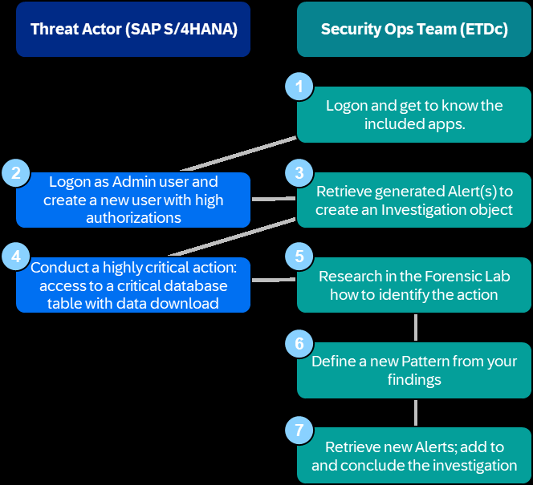

---

## 1. Logon to the Monitoring Console of SAP Enterprise Threat Detection, public cloud

> This system & credentials are available during the planned workshop hours only.
> Please let us know if you'd like to have access afterwards; we're happy to check how long we can extend your access.

Access the *SAP Enterprise Threat Detection, public cloud* monitoring console

**IMPORTANT:**
- You should get the below start page (if not, please empty your browser cache and try again).
- Here, select the first entry ("httpsetdtestlogs.accounts.ondemand") to log on with the generic workshop users below (not any personal credentials – they won't be recognized in this cloud application).
- Do NOT choose the "Default Identity Provider" (here, the generic users won't work).

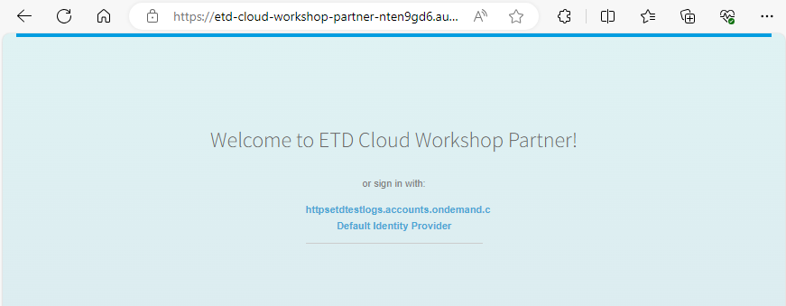

In the ensuing (logon) screen, use the ID indicated to you (01-35; afterwards referred to as "##").

> **User:** demo##@etdsap.com  
> **Password:** ETDSAP_Demo.

If you inadvertently lock the password, please notify the instructor.

If you receive a blank screen saying "Where to", please clear the cache, then close and restart the browser. If you may also open an private browsing window (often "incognito" or "InPrivate"). Log on again.

**User:** teched##@etdsap.com  
**Password:** will be provided in the session

> **Note:** This system & credentials are available during the planned workshop hours only. Please let us know if you'd like to have access afterwards; we're happy to check how long we can extend your access.

Upon initial logon, In case you get pop-up message to select a Tenant, than click the Select Tenant screen for selecting a specific Tenant:

As a monitoring agent providing services to multiple clients, you will log on to your organization's own productive Tenant; however from here commonly access and work in the specific Tenant of a client, which you can select from this list reflecting all clients/Tenants linked to your organization.

For this hands-on there is only one customer system linked. Click on the blue hyperlink and select "Workshop Demo Customer".

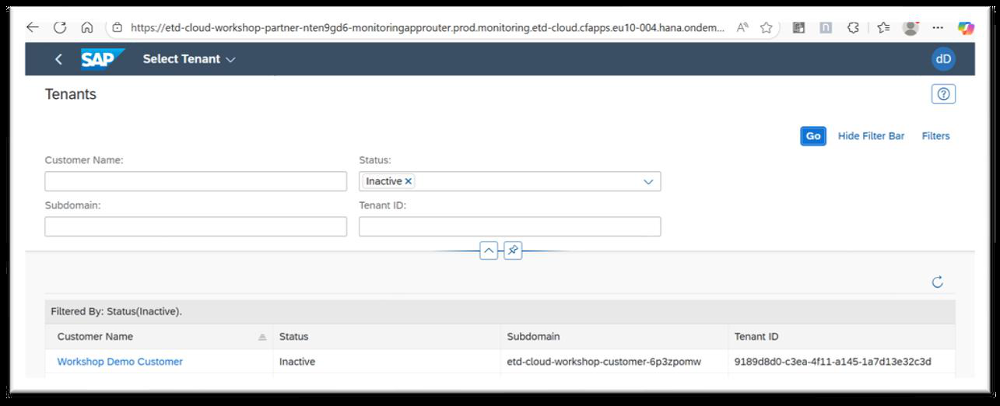

You will then see the *SAP Enterprise Threat Detection, public cloud* monitoring console. Take a bit of time to check by a few apps and how they behave.

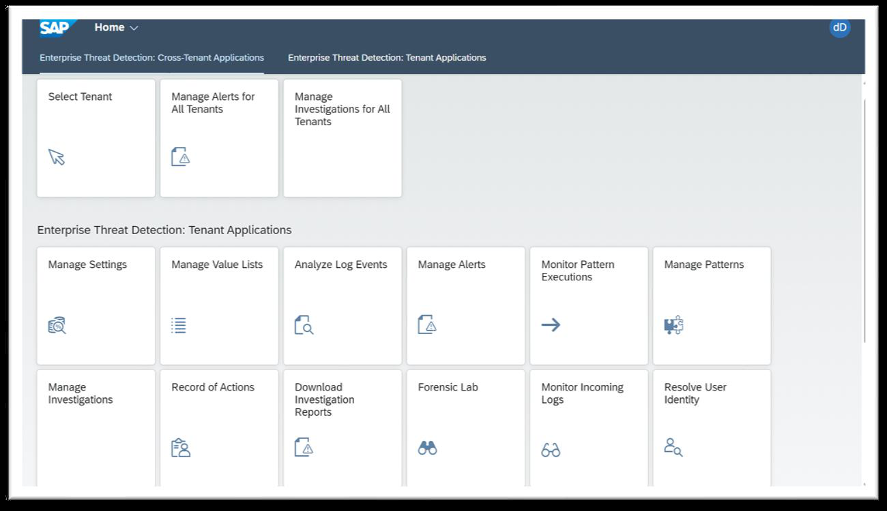

### 1.1 Got a Warning 'Select a Tenant'

If you encounter a the warning popup

the system has lost the information which Tenant you've been working on (most likely you had been logged out).

In this case, either start the SAP Enterprise Threat Detection, public cloud console again via the above link.

Alternatively, you can manually set the correct tenant:
- In the section for "Cross-Tenant Applications", open the app "Select Tenant".
- Remove filters "active" and press "go".
- The entry "Workshop Demo Customer" will show; select this so the system is aware which Tenant you are working on – which is relevant in case you're a partner providing monitoring services to multiple clients

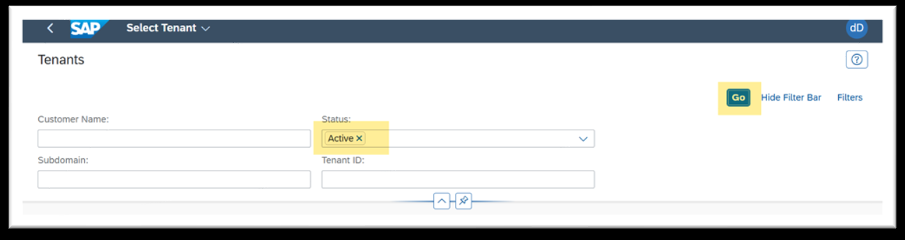

### 1.2 UI Round trip

In Manage Setting tab, users can manage system setting like retention times and time zone etc.

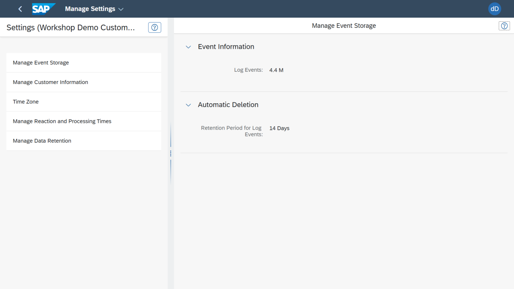

In Value list tab, users can manage value lists which are allow or disallow list where system analyst and put custom values and even can create custom value lists

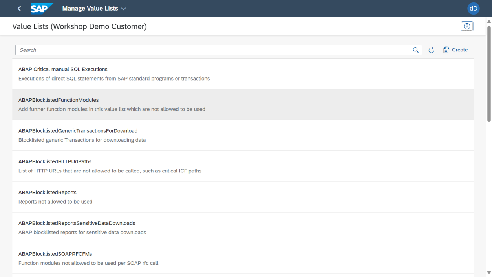

In Analyze Log Events tab, system analyst and view and analyze customers normalized log data.

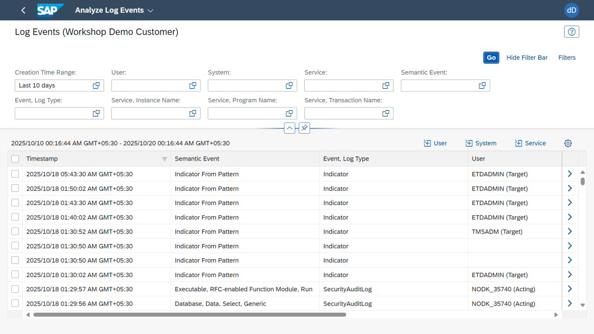

In Manage Alerts tab, system analyst and view and analyze generated alerts.

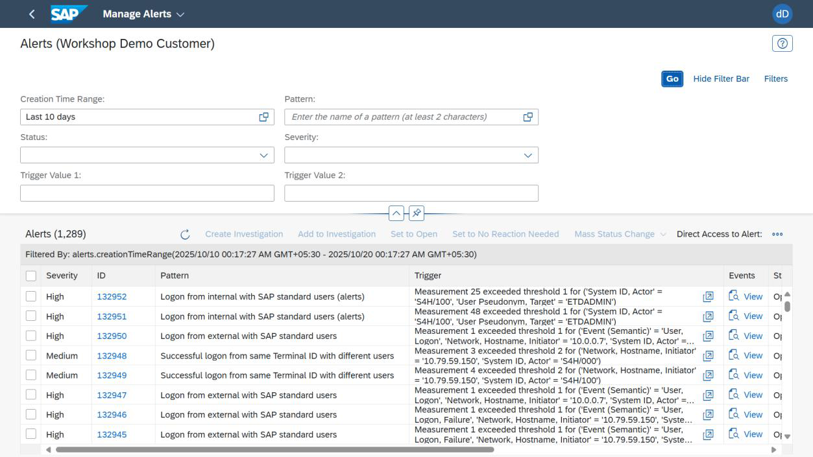

In Pattern Executions tab, system analyst and view and check status of pattern executions

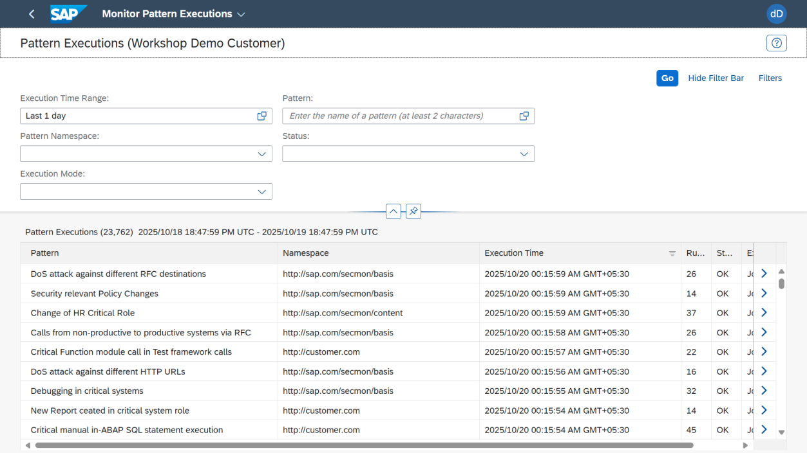

In Pattern tab, system analyst and view and create patterns (i.e. use cases)

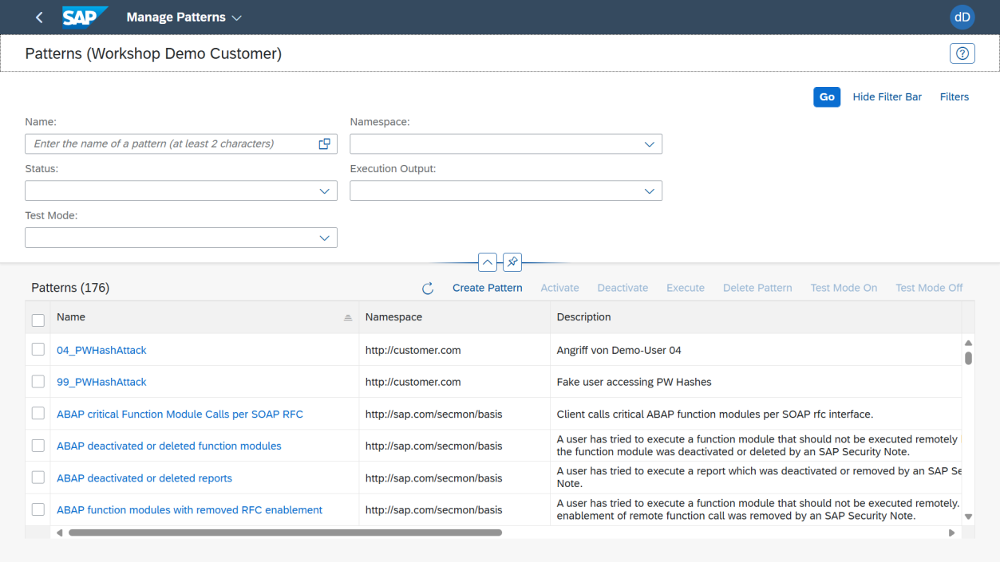

In Investigations tab, system analyst and view and manage investigations.

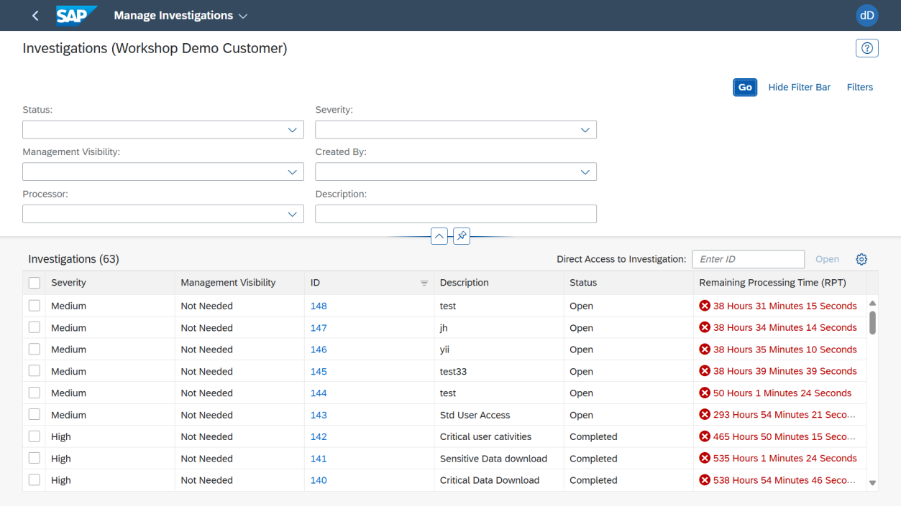

In Records tab, system analyst and view use activity logs of ETD system

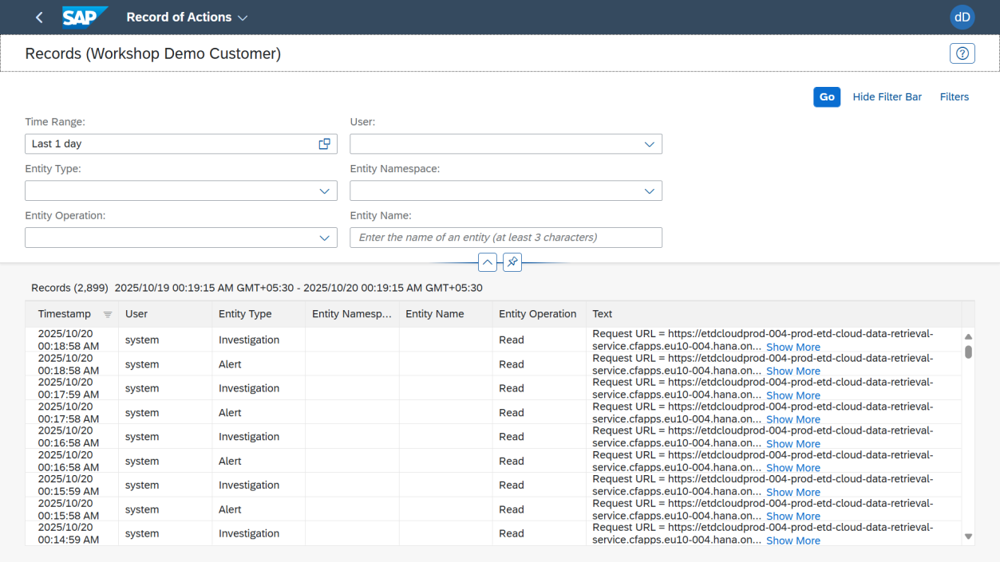

In Investigations Report tab, system analyst and view investigations

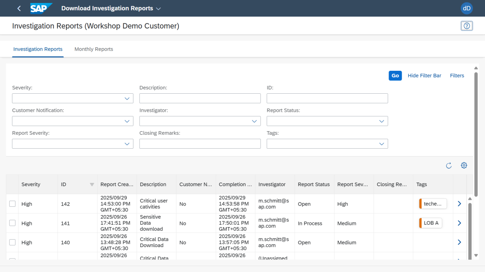

In Workspace tab, system analyst and view and create Workspace

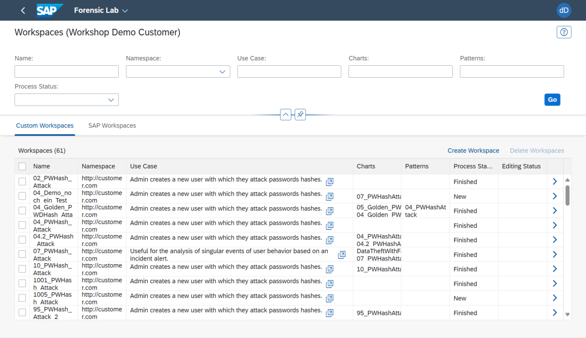

In Manage Incoming logs tab, system analyst and view incoming logs

In Resolve user identity tab, system analyst and view and pseudonymize and pseudonymize user name

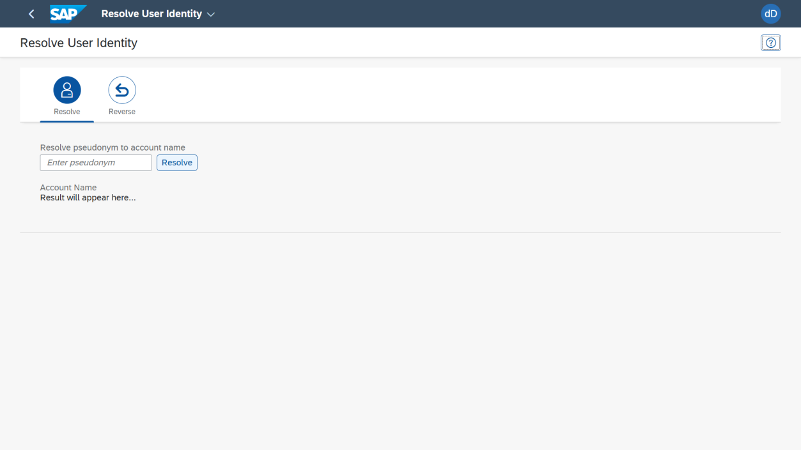

---

## 2. First Log Events from SAP S/4HANA

> **Please note:** in this exercise, every workshop station/computer has a designated set of users already existing; throughout the description, "##" is the number of your workshop computer ID.

> This system & credentials are available during the planned workshop hours only.
> Please let the instructor know in case you’d like to have access afterwards; we’re happy to
> check how long we can extend your access.

In this section, you will conduct actions in SAP GUI to generate Log Events which in return will result in Alerts in SAP Enterprise Threat Detection, public cloud.

### 2.1 Logon & Preparation Steps

- access the WebGUI interface: https://52.1.244.180:44301/sap/bc/gui/sap/its/webgui
- Proceed through the "advanced" mode in case you get a warning of unsafe/non-private connection – which might look like this:

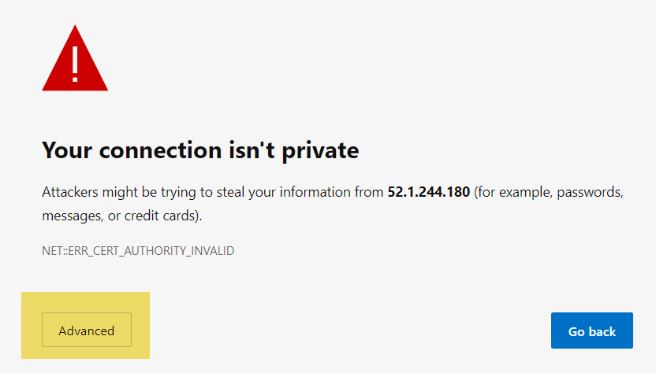

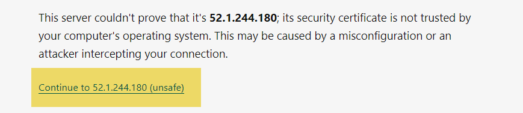

**Log on credentials:**

**User:** ETDADMIN##  
**Password:** Will be provided in the session

> **Note:** This system & credentials are available during the planned workshop hours only. Please let the instructor know in case you'd like to have access afterwards; we're happy to check how long we can extend your access.

If you inadvertently lock the password, please notify the instructor.

- Activate the display of the "transaction code entry" field for easier navigation:
  Go to Menu → Settings → Visualization.
  Activate "Show OK Code field" as well as "Show dropdown lists with keys" and "Sort dropdown lists by their keys" and save.

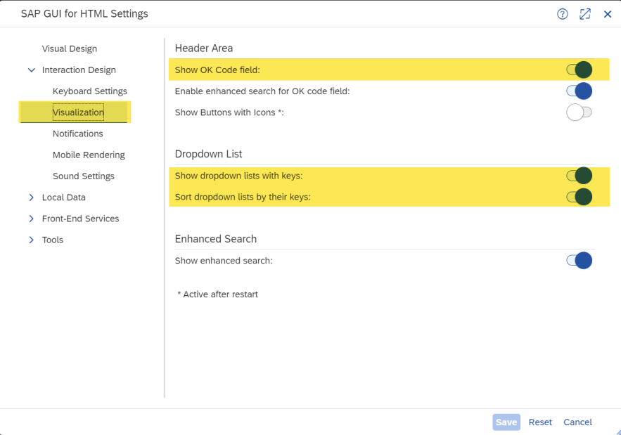

- Leave the menu. Your start screen should now show the transaction code entry field:

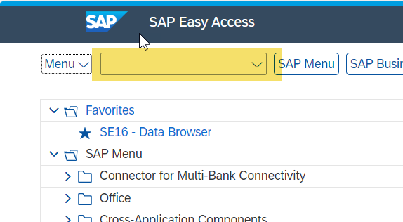

### 2.2 Creating a User With High Privileges

You will now conduct an action which triggers your first logs into SAP Enterprise Threat Detection, public cloud: creating a highly privileged user.

- In the transaction code entry, enter "SU01" (User Maintenance), and hit enter.

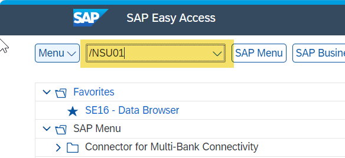

- In the User Maintenance transaction start screen, enter your user ETDADMIN## in the User field, and select "copy".

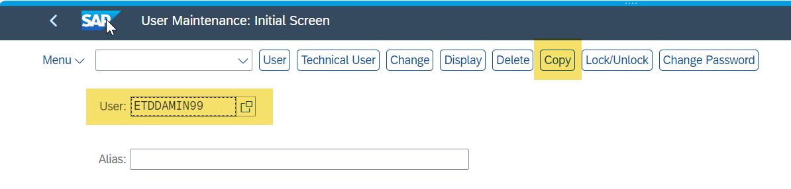

- In the pop up screen, maintain the new user name "ETDDEMO##" in the "To:" field; deselect the option to copy authorization profiles, and press "copy":

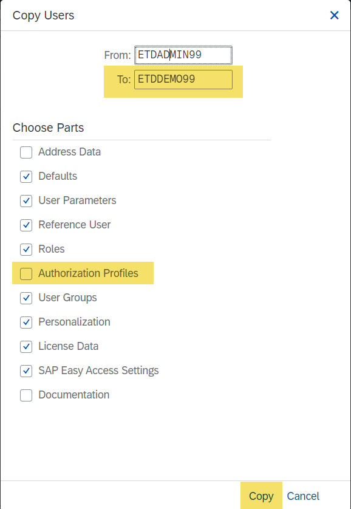

- In the resulting screen set, on tab "Logon Data", assign an initial (temporary) password (it is suggested to note down this password as you will need this to log on with ETDDEMO##). Then save the user.

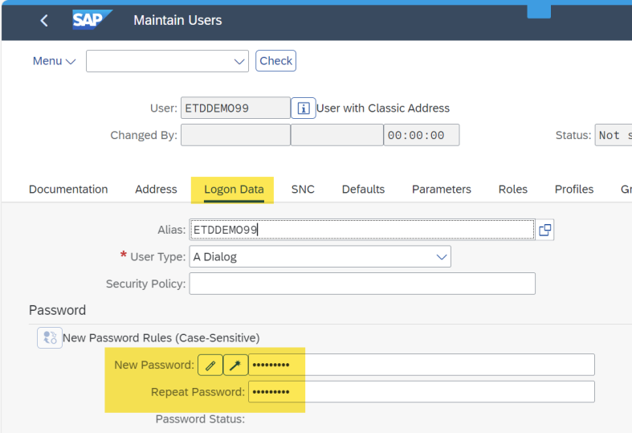

- Back in the SU01 initial screen, put in your user ETDDEMOxx and select the button "Change". Move to the tab "Profiles", add the profile "SAP_ALL" (making this user a super user basically without restrictions), and hit enter. Then press "Save".

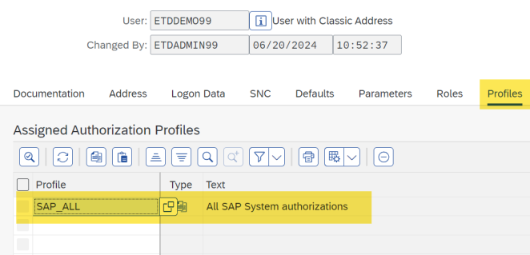

- This has been the first set of noteworthy actions. Exit the SAP Web GUI (button "Exit" in the top right; or hit Shift+F3; or in the transaction code entry field, type "/nex").

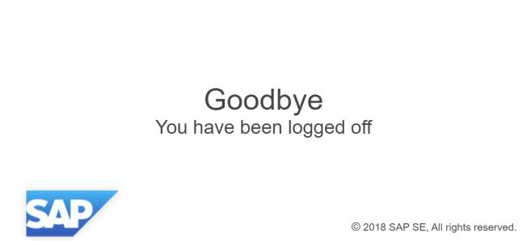

---

## 3. Checking Alerts and Creating Investigations

You will now look at alerts in SAP Enterprise Threat Detection, public cloud and create an Investigation object out of it.

Return to the SAP Enterprise Threat Detection, public cloud Monitoring Console. If necessary, log on again with your user techedxx@etdsap.com, and in the Select Tenant app, select the tenant "Workshop Demo Customer".

If you receive the 'Select a Tenant' popup, refer to section 1.1 how to resolve.

### 3.1 Check for Log Events

- Choose the app "Analyze Log Events" to check that your activities have generated log entries. Filter for your Admin user ETDADMIN##. If there are too many entries, additionally filter for semantic Events about "user" or "user admin" and you should see a shorter list.

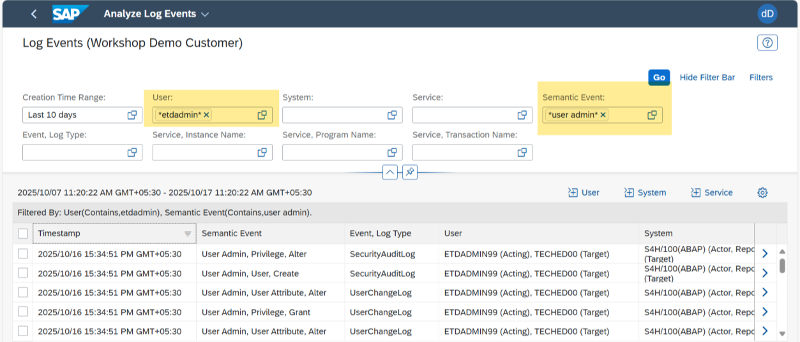

- Note how the "user" column refers to the ETDADMIN## user as "acting", but there is also an entry for "Target": this is a pseudonym for your newly generated ETDDEMO## user. Note down this pseudonym for later use.

### 3.2 Search for Alerts

- Choose the app "Manage Alerts". The list should be populated with several recent entries. If yours is not in the system yet, give a little time – generation for these Alerts is triggered by a job every few minutes.
- Then, filter for your user ETDADMIN## in the Trigger Value 1 or 2 fields, and press "go". Mark some Alerts you find relevant (or all), and in the bottom right corner, click on "Create Investigation".

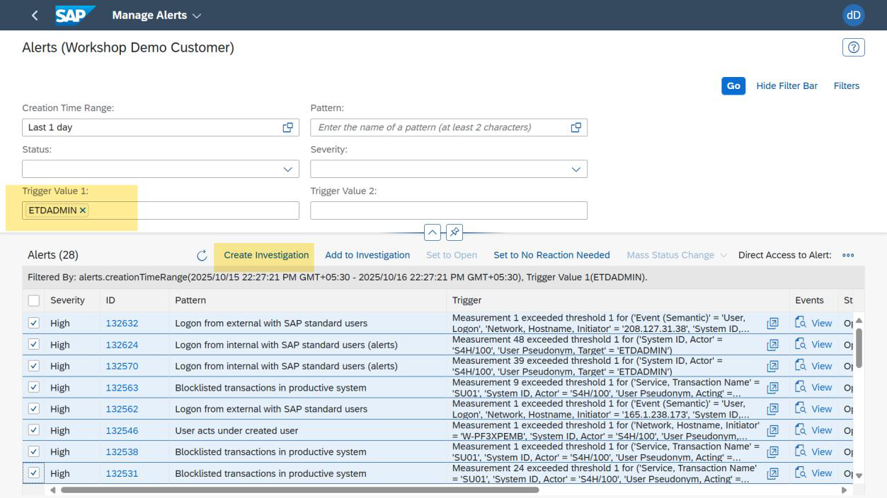

- In the ensuing "Create Investigation" screen, maintain a description referring to your demo ID so you can identify the object later. For "processor", there are only few options available; just assign any email address.
- What else you enter is not of relevance in the demo flow. Of course, in a productive system these settings determine how the Investigation, if confirming a problem, will be made visible and which follow-on actions it triggers.
- Next, click on "Add and Show Investigation".

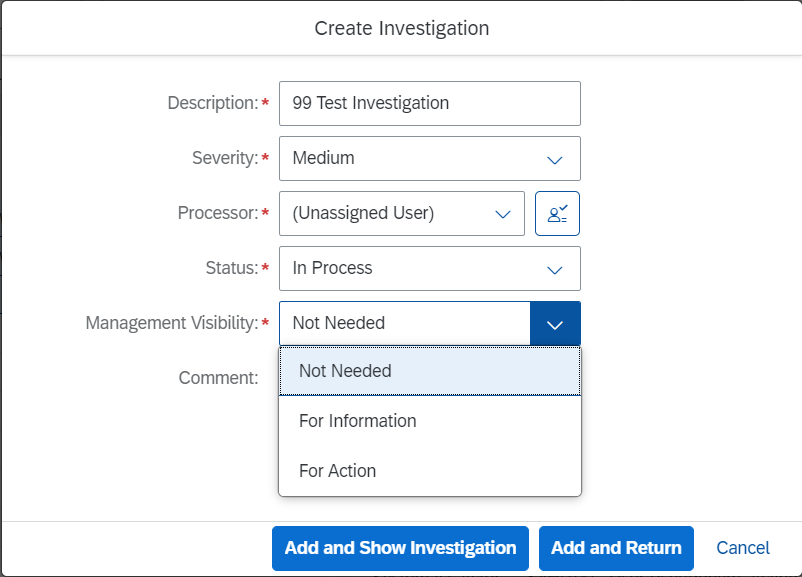

You will then proceed to the main screen of the Investigation you have just created, resembling this example:

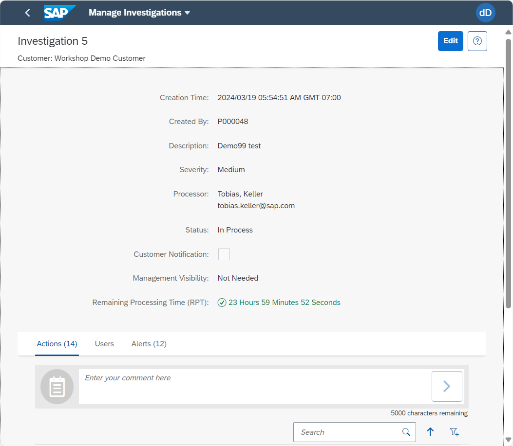

### 3.3 Interpreting the Investigation Entries

What is the meaning of the different parts of the Investigation object?

- In the Investigation screen, you will find the header information you have maintained before. You can choose to "edit" in case you wish to change the information.
- In the middle section, click on "Alerts". Here, you can research the Alerts, have a look at some of the complete triggers explanation texts and how they codify the core findings in this text. You may also review some of the triggering Events.

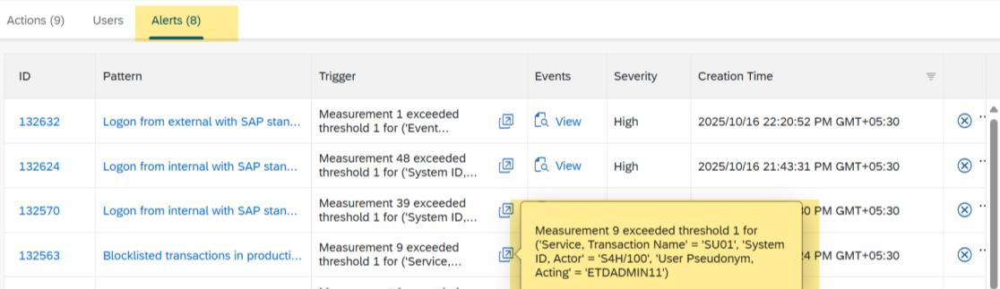

- In the Trigger text, you should also come across at least one additional user – in the form of a "User Pseudonym, Target". Note down the pseudonym of this user (which you will later see refers to your ETDDEMO## user that was granted high level authorizations).
- In a real life scenario (but beyond the scope of a demo like this), user pseudonyms or other specific pointers like IP addresses, terminal ID/computer name etc. would be used to extend the search for alerts which are relevant for an investigation.
- Return to the tab "Actions". Here, you may document anything - actions you have been performing, preliminary findings etc. and deductions these allow. These insights will be rendered in the investigation report later and can strongly increase the value and actionability of an investigation.

---

## 4. Trigger a Critical Action from SAP S/4HANA: Download of a Critical Database Table

In this section, you will return into the role as a rogue actor and conduct several more actions resulting in Log Events flowing into SAP Enterprise Threat Detection, public cloud.

First, you need to log on to the SAP S/4HANA with the newly generated user ETDDEMO##.

- In order to log on with your new user ETDDEMO##, you need to either open a new "incognito"/"private" session in your browser.
  Alternatively, you may also switch to another browser.
  Emptying the browser cache is also an option. Here, mark at least history, cookies, and password sections, then confirm.
- Now, call the Web Gui console https://52.1.244.180:44301/sap/bc/gui/sap/its/webgui, logon with your new user ETDDEMO## and the password you have chosen. At start, you need to set a new password (suggestion to take a note).

**Executing a critical action:**

- With the transaction code entry, navigate to transaction SE16N. This is a table display/download transaction (and a tool so powerful that it should generally not be made available in a productive system...).

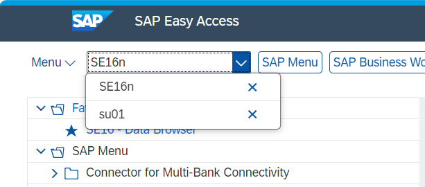

- In the transaction, call table USR02. USR02 is a table which holds personal information (bad enough) and stores user password hashes 
>very critical: Although the passwords are hashed out, this would not stop a determined attacker. They may either crack simple passwords and, if they have identified out one single password from any user, they can take the respective hash value to overwrite the hashed password of any other user, allowing them to log on as that user i.e. impersonate the other user. Theoretically the password hashes should be "salted" however, in practice, this attack vector has been working quite reliably. (That said, think about the value of MFA and other tools independent from passwords).
- Access with the function "Online":

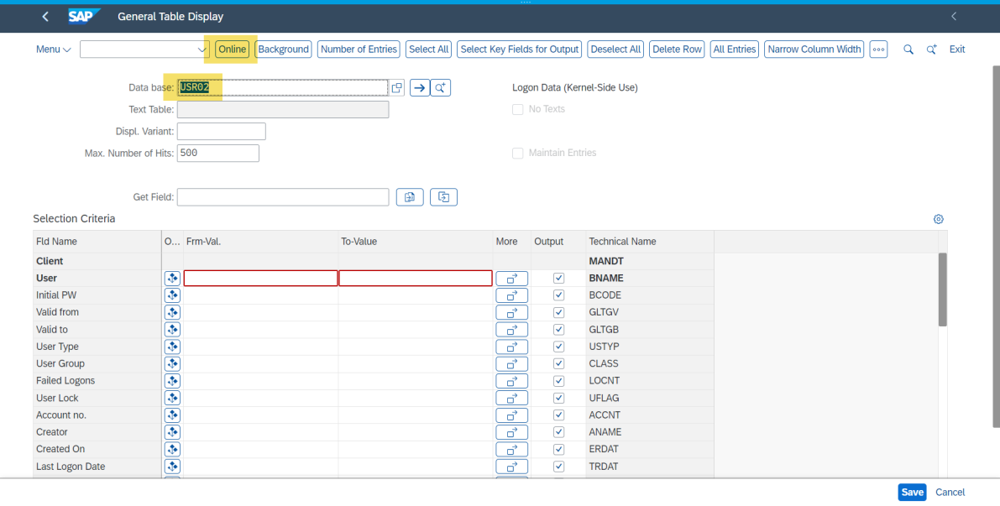

- Search for your user ETDDEMO## and display details. Check out Password Hash Value (real table attribute name PWDSALTEDHASH), towards the end of the table.
- Return to the table display and trigger a download with the icon "Export", then choose "local file" and confirm the following two interactions. The file can be stored anywhere – in case you need to indicate a directory, pick any that you like.

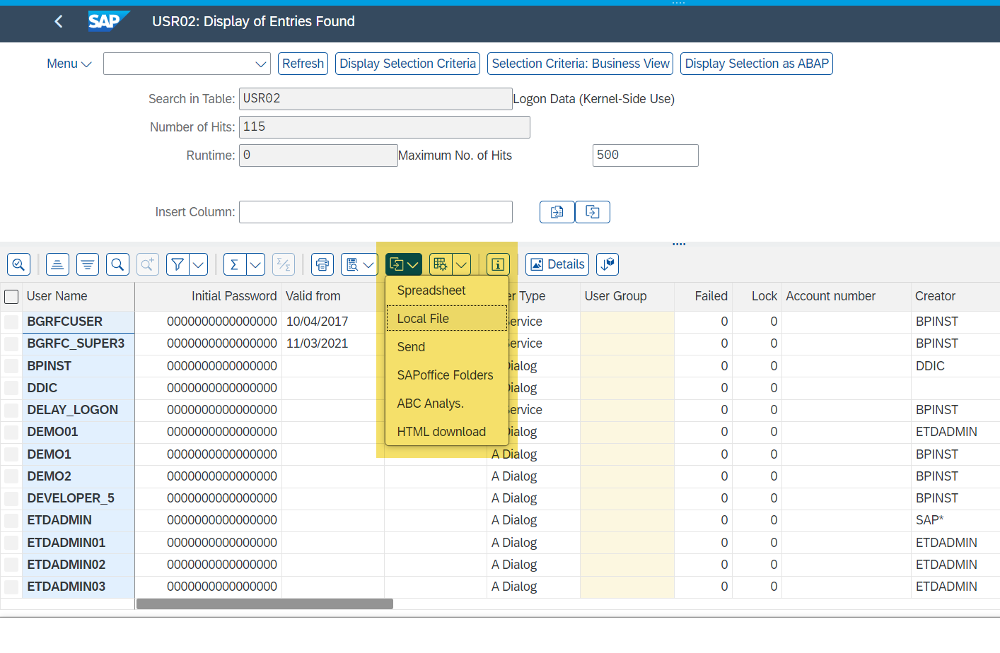

You have conducted a seemingly simple but dangerous activity which should be resulting in at least one Alert in SAP Enterprise Threat Detection, public cloud.

Let's continue to retrieve and process them!

---

## 5. User & Environment Behavioral Analysis – Identify the Critical Action in the Forensic Lab

The Forensic Lab is the area where you work on ways to identify new potential threat vectors by filtering your way through the large volume of log entries until you arrive at a definition yielding few and specific logs that should point at a real threat.

Here, we will build a workspace with filters capable of identifying the case where a user is granted high authorizations, and then accesses a critical resource.

To this end, we will be building two filtering Paths linked by a Reference:
- "Path 1" should be capable of establishing a list of users who have been granted critical authorizations in the past 2 days.
- "Path 2" to the right shall be able to establish a list of all users who have accessed a critical resource recently.
- The "Reference" allows to single out users which are in the result lists of both paths.

The Workspace will look similar like this one:

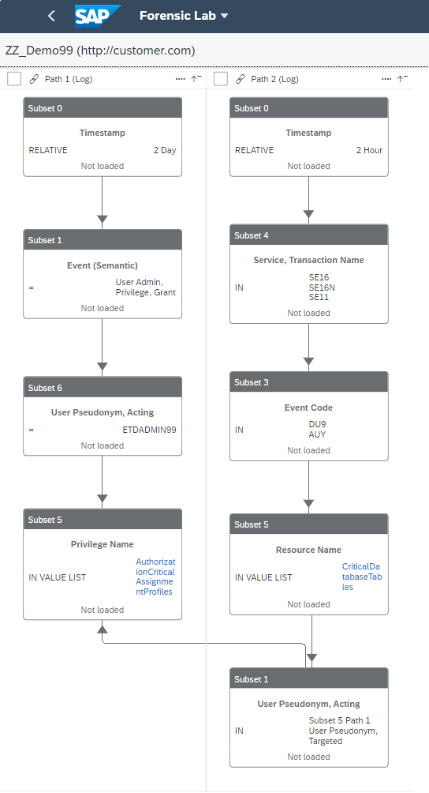

### 5.1 Build up a Workspace

- Return to the monitoring console of SAP Enterprise Threat Detection, cloud edition.
- Go to the app "Forensic Lab".

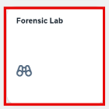

- In the area "Custom Workspaces", you see a list of existing workspaces.
- Create a new Workspace with Name ##TechEdPWHashAttack, by replacing the ## with your participant number. Enter some additional information (Use case, Severity, Description), and then click on 'Create'

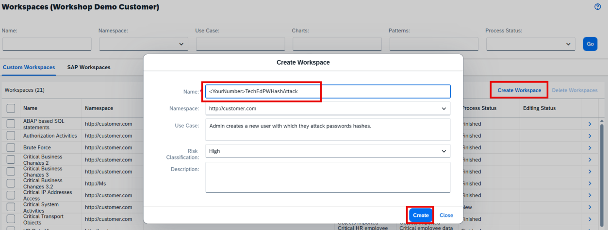

- You then see your new Workspace in the Workspace list. To open it, click on the arrow on the right for your Workspace.

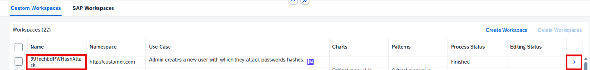

- Your new workspace contains already a first Filter Path (Path 1) with a subset (Subset 0) to filter on the time range.
- Click on the 'Refresh' Button 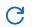 to see incoming log data.
- Click into the Subset 0, to get some Symbols at the right
- Click into the Pi-Chart Symbol to view the data in a chart preview. You see as a default the distribution of log events, related to their systems
- By clicking on the Drop-Down-Symbol, you can select other attributes of the ETD normalized Data Model

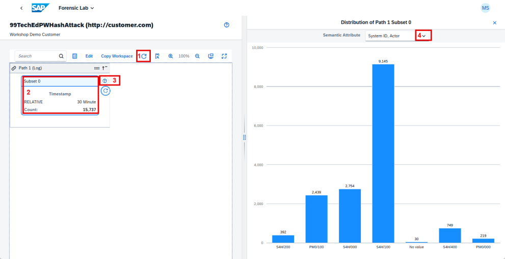

By e.g. selecting 'Event (Semantic)' you get a distribution of all log events, related to the Semantic Events.

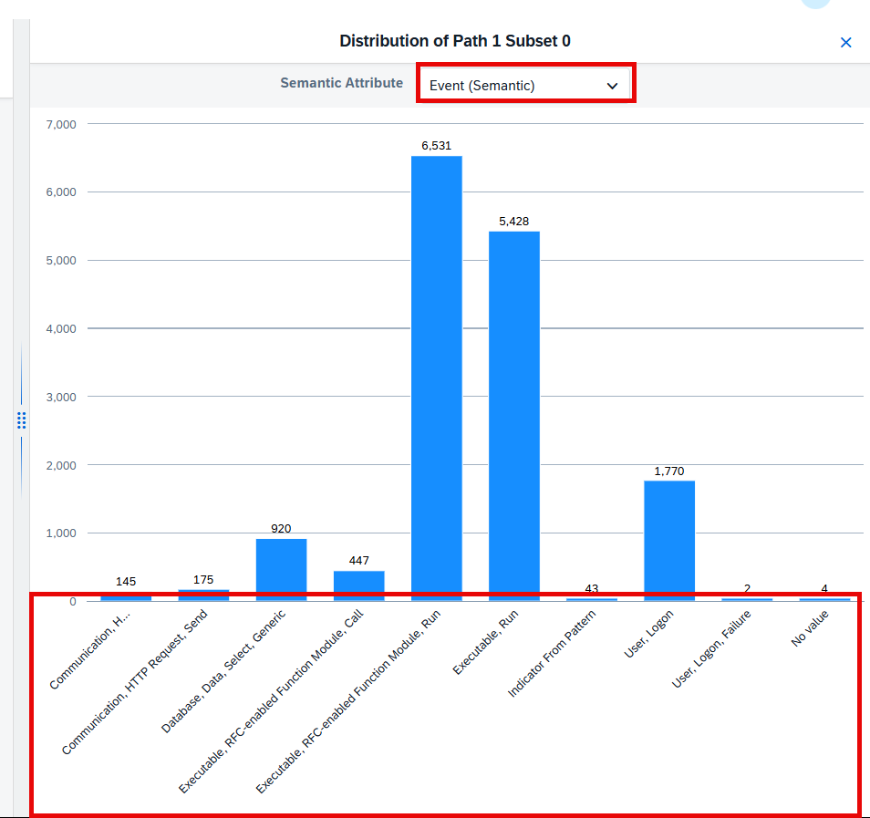

- By clicking the 'Edit' Button 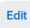, you start modelling your workspace. You see now some additional Symbols at the right of your Subset 0.
- Change the relative Timestamp of Subset 0 to 2 hours by clicking on the symbol 'Edit Subset' 

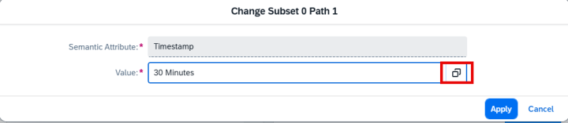

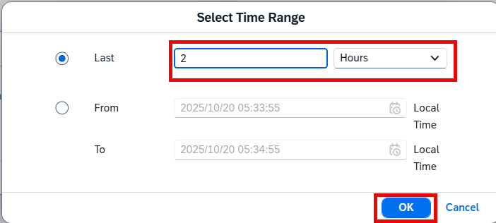

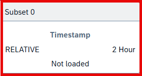

> **Information:** To be able to see some data in the following filter steps, directly before the session started, all ETDADMIN## users in the S4/H system got a mass change by adding a high privilege.

- By clicking on the 'Create Subset'  Symbol, a Popup appears to enter the filter criteria for the next subset. Please enter:
  - **Semantic Attribute:** Event (Semantic)
  - **Type:** Value
  - **Operator:** Equal
  - **Value:** User Admin, Privilege, Grant
- Then click 'Apply'.

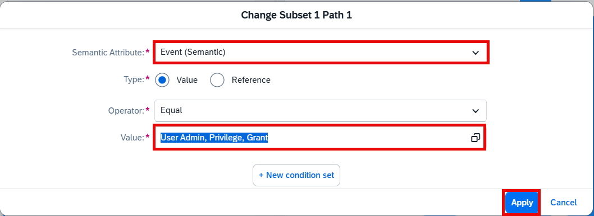

- Your new Filter Subset 'Subset 1' appears. By clicking into the Subset 1, you can use the small symbols at the side (especially the Pie-Chart Symbol) to do a preview on the data filtered in Subset 1 in the Preview area.
- Sometimes click on the 'Save' Button

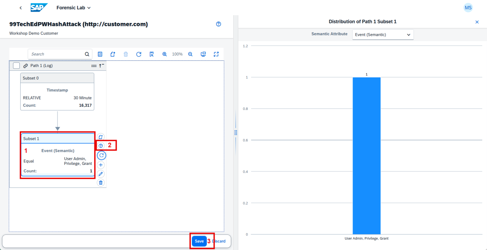

- Create a new Subset to filter (for Demo Purposes) on your own ABAP User ETDADMIN<YourNumber>. In the Popup enter:
  - **Semantic Attribute:** User Pseudonym, Target
  - **Type:** Value
  - **Operator:** Equal
  - **Value:** ETDADMIN<YourNumber>
- Then click on 'Create'

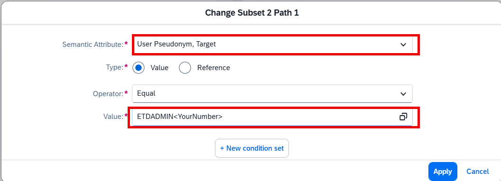

- You new Subset is showing as 'Subset 2'. By refreshing and selecting the Pie Chart you can see some data in Subset 2.

> **Information:** ETD provides a role concept about users, systems, IP addresses, etc. An 'Acting User' is a user, who does something. A 'Target User' is e.g. a user, to whom something is done.

- Create a new Subset with the following values:
  - **Semantic Attribute:** Privilege Name
  - **Type:** Value
  - **Operator:** In value list
  - **Value:** AuthorizationCriticalAssignmentProfiles
- Then click on 'Create'

- You new Subset is showing as 'Subset 3'. By refreshing and selecting the Pie Chart you can see some data in Subset 3.

> **Information:** The value list AuthorizationCriticalAssignmentProfiles contains typical predelivered values for Profiles (e.g. SAP_ALL, SAP_NEW, ...). The filter is then set as an 'IN'-filter about all values.

To be able to corelate the provisioning of a high privilege with the miss-use of the privilege (in the example: look up Password hashes), a second filter path needs to filter on that activity, and then corelate to the high privilege provisioning (via reference filter).

- Click the 'Create Path' Symbol

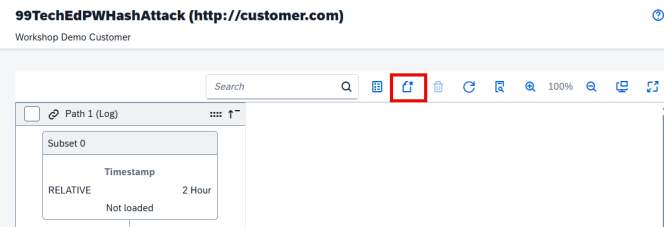

- Select the Context 'Log' and 'save'. Your second filter path 'Path 2' is created and already contains a timestamp filter in Subset 0.
- Again, change the timestamp filter to Last 2 hours (to be able to see some data). Then you can click the 'Refresh' symbol and the 'Pie-Chart' symbol to see the data of Path2, Subset 0.

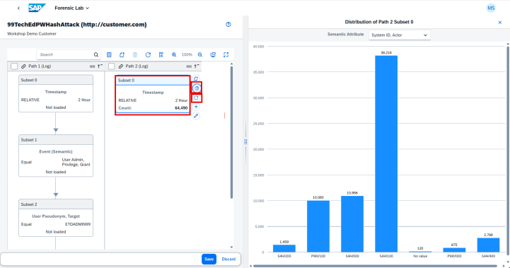

- Create a new Subset with the following values:
  - **Semantic Attribute:** Service, Transaction Name
  - **Type:** Value
  - **Operator:** In
  - **Value:** SE16, SE16N, SE11
  - **Hint:** To enter the In-Value List, enter the 1st value, then press 'Enter', then enter the 2nd/next value and always press 'Enter' in between. The single values are shown separatedly.
- Then click on 'Create'

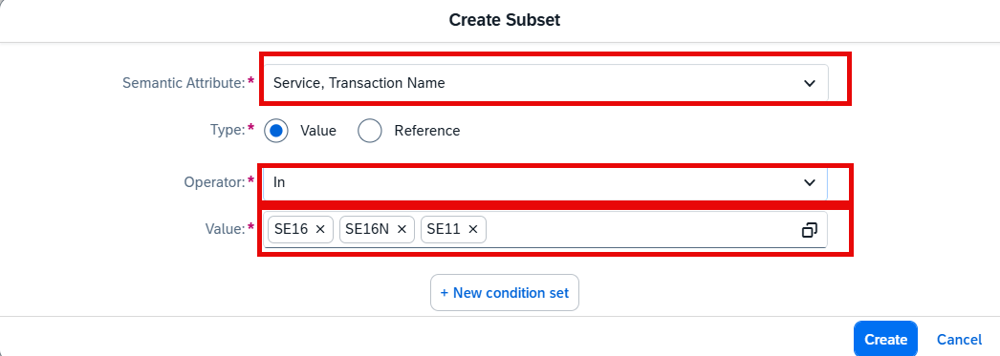

- Your new Subset is showing as 'Subset 1' in Path 2. By refreshing and selecting the Pie Chart you can see some data in Subset 1.
- Create a new Subset with the following values:
  - **Semantic Attribute:** Event (Semantic)
  - **Type:** Value
  - **Operator:** In
  - **Value:** Data, Download ; Database, Data, Select, Generic
  - **Hint:** To enter the In-Value List, enter the 1st value, then press 'Enter', then enter the 2nd/next value and always press 'Enter' in between. The single values are shown separately. You can as well check if the Semantic events are visible in the selection box, then you can select them via checkboxes
- Then click on 'Create'

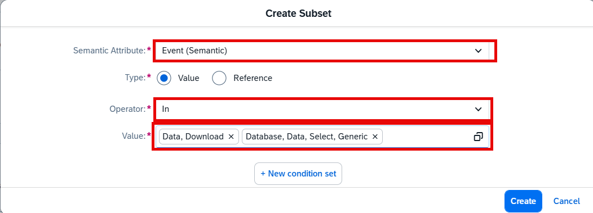

- Your new Subset is showing as 'Subset 2' in Path 2. By refreshing and selecting the Pie Chart you can see some data in Subset 2.
- Create a new Subset with the following values:
  - **Semantic Attribute:** Resource Name
  - **Type:** Value
  - **Operator:** In value list
  - **Value:** CriticalDatabaseTables
  - **Hint:** The Attribute 'Resource Name' contains objects (like DB tables, files) from where/to which data is read/written
- Then click on 'Create'

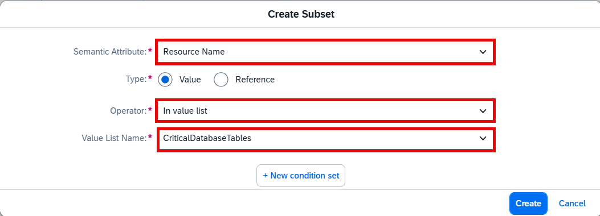

- Your new Subset is showing as 'Subset 3' in Path 2. By refreshing and selecting the Pie Chart you can see some data in Subset 3.
- Finally, create a Subset, which corelates between Path 1 filter results for provisioning of high privileges to a target user, and path 2 results for the same acting user accessing a critical DB table with Password hashes. Use the following values:
  - **Semantic Attribute:** User Pseudonym, Acting
  - **Type:** Reference
  - **Operator:** In
  - **Reference To:** Subset 3, Path 1
  - **Value:** User Pseudonym, Target
- Then click on 'Create'

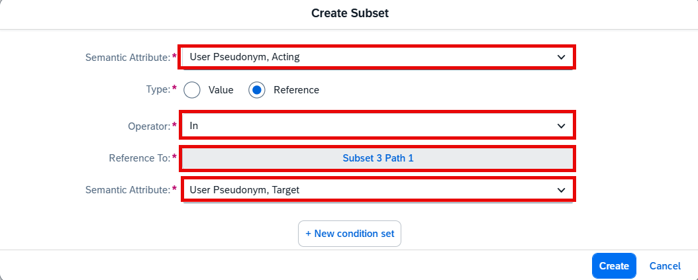

- Your new Subset is showing as 'Subset 4' in Path 2. By refreshing and selecting the Pie Chart you can see some data in Subset 4. Data can be seen if within last 2 hours the user got a high privilege, and in the same timeframe accessed a critical DB table.

The final result should look like this:

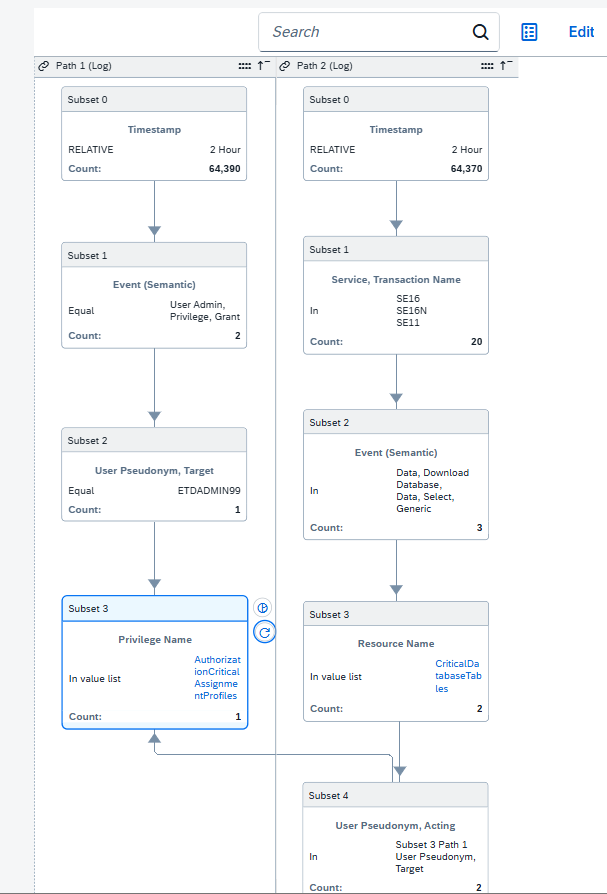

#### 5.1.1 Assigning a Chart

The Workspace and filters you have built defines a way to identify events pointing at a new threat. In real life, if you suspect this is an attack and that it might repeat, you want to re-use these definitions and actually automate them to throw an Alert whenever the same occurrence happens again.

To this end, the logical next step in SAP Enterprise Threat Detection, cloud edition is to define (name and save) the Browsing Chart pertaining to one of your Subsets.

Such a named Chart can then be used to build a new Pattern – which generates Alerts whenever Log Entries pertaining to the Subset/Chart reach a predefined threshold (e.g. "more than 5 processed bank account numbers per day", or "every single access to a critical database table").

This is the primary way of building new content in SAP Enterprise Threat Detection, public cloud.

In this demo case, we look to the final Subset on "User Pseudonym, Acting" in Path 2. Switch to edit mode again, and mark Subset 4, Path 2. Then press "Create Chart":

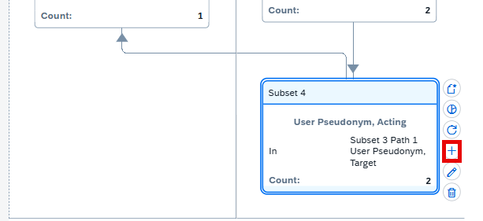

In the pop-up, assign a name among the lines of "<YourNumber>PWHashAttack", and a description. Mark down the name.

For measurement, choose the "count" * and a fitting Display Name if you like:

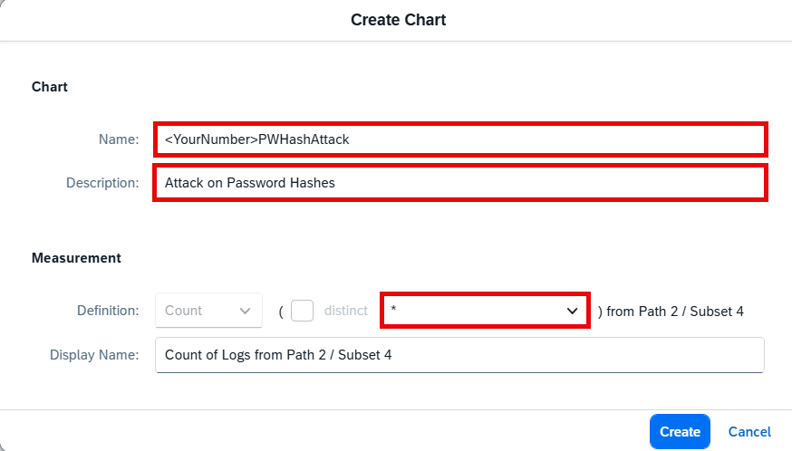

Click on "Create". In the ensuing screen, choose to "Group By" the semantic events
- Resource Name
- Service, Transaction Name
- System ID, Actor
- User Pseudonym, Acting

The resulting Chart should be looking something like this. Note how the grouping results in the resource USR02 and a user pseudonym being displayed (which should be the pseudonym assigned to your ETDDEMO## user):

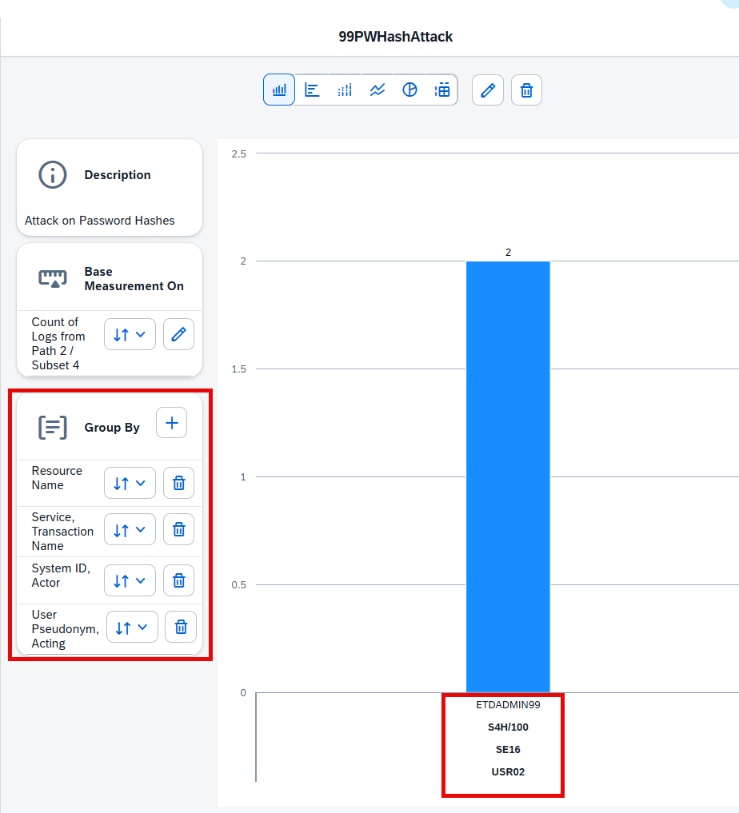

- **Finally, click the 'Save' Button**

> **Note:** Per each deviating combination of the (in this example) 4 grouped attributes, there would arrive another bar in the bar chart.

---

## 6. From Workspace to Pattern to Alerts

### 6.1 Understanding Patterns

- Return to the Console Home Screen and Enter the "Manage Patterns" app.
- Choose to "Create Pattern" and in the pop-up maintain the relevant information. Importantly, set the status to "Active", frequency to the lower limit of 5 minutes; and Threshold to >=1. In the "Chart" field, retrieve and assign the Chart you have created.

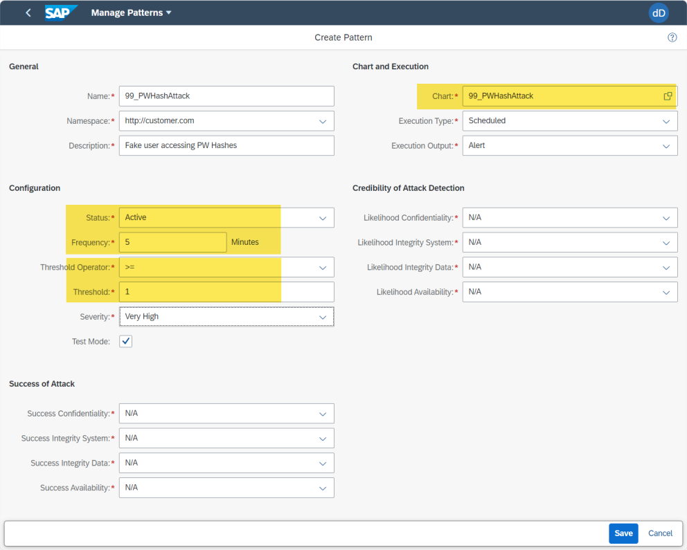

The fields for Success of Attack and Credibility of Attack Detection can help to gauge the severity of a breach, but does not have a direct influence in the context of this hands-on session.

> **Information:** If you mark the checkbox 'Test Mode', then alerts will as well be created, and be visible in the alert list, but they will be in status 'Test Mode' and can be deleted later-on. Reasoning is, that in 'Test Mode', the Pattern is still reworked, until it functions properly, and does not create too many false positives. Later, the marker can be removed, and from that time on, the alerts cannot be deleted any more, as they are now seen as real alerts, and deletion might cause compliance issues.

Save your work.

In the resulting screen, trigger the button "Execute" to run the pattern on the logs in the hot storage (evaluating past logs for the event happening), and generate Alerts.

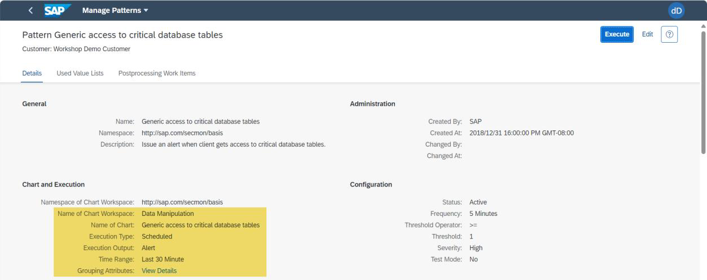

- Finally, return to the Manage Alerts app. Filter for Alert(s) pertaining to your pattern xx_PWHashAttack. Have a look at the "trigger" field, detailing the resource and the user (pseudonym) responsible for creating the alert (if necessary, expand the text/field).

Your Alert looks like this:

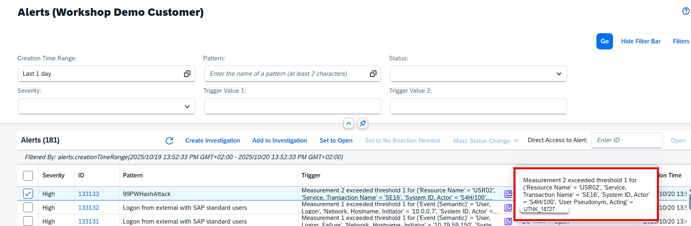

- Mark the alert(s), and add them to your Investigation:

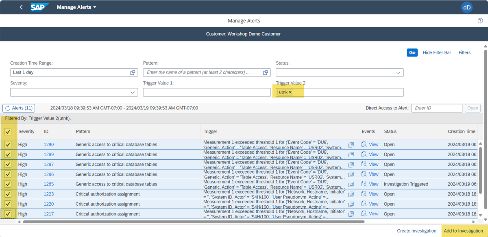

In the following screen, press "Add and Show Investigation":

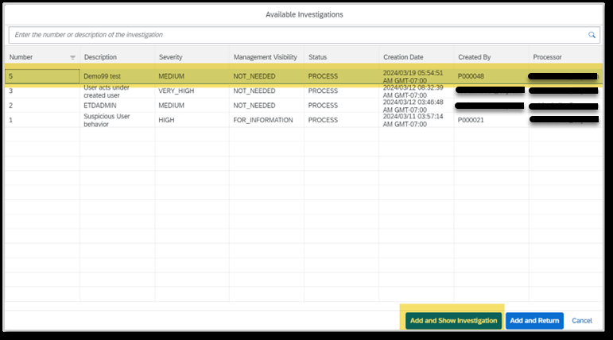

---

## 7. Finalize the Investigation

You can now conclude the Investigation.

### 7.1 Information: Maintain your email ID to receive investigation reports

In SAP Enterprise Threat Detection, cloud edition, finalized and relevant investigations will result in reports generated and sent to the appropriate/responsible persons on customer/client side. It is possible to maintain a mail address to receive information about a newly created report, if the checkbox 'Customer notification' is marked within the Investigation during processing. The mail address can be maintained within the 'Manage Settings' Tile.

> **Please note:**
> - Please don't exchange the mail address, neither to an own one, nor to another one, although you might have the authorization. It results in receiving multiple reports also from other workshop participants to the maintained mail address.

### 7.2 Finalize the investigation

- In the app for "Manage Investigations", you will find the header information you have maintained before and can edit. You may choose "edit" in case you desire to change the information.
- In the middle section, click on "Alerts". Here, you can research the Alerts, have a look at some of the complete triggers explanation texts and how they codify the core findings in this text. You may also review some of the triggering Events.

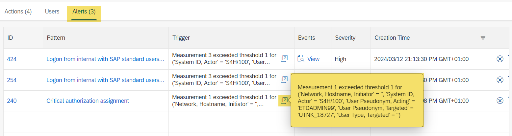

- In the Trigger text, you may also come across additional user pseudonyms or references to IP addresses from where the triggering actions were initiated. These can be valuable leads to follow up on – If you have time left, you may note down the pseudonyms (or also users in clear) and IP addresses, return to the Manage Alerts app, search for more Alerts involving these pseudonyms, and add the results to your Investigation.

- Finally, return to your Investigation. You may comment/document what actions you have been performing, and what deductions these allow.
- Then return to the tab for "Users". For each pseudonym, trigger the de-pseudonymization:

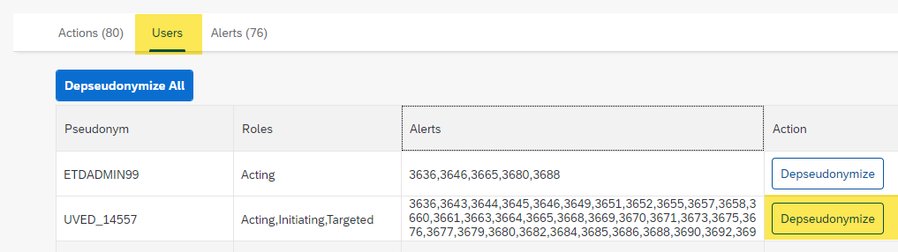

- This will reflect in the "Actions" tab – have a look at the clear user names. You should be spotting your ETDDEMO## somewhere!

- Lastly, finalize the Investigation. Click "Edit", update the header information as needed, set status to "completed", activate "Customer Notification", and save.

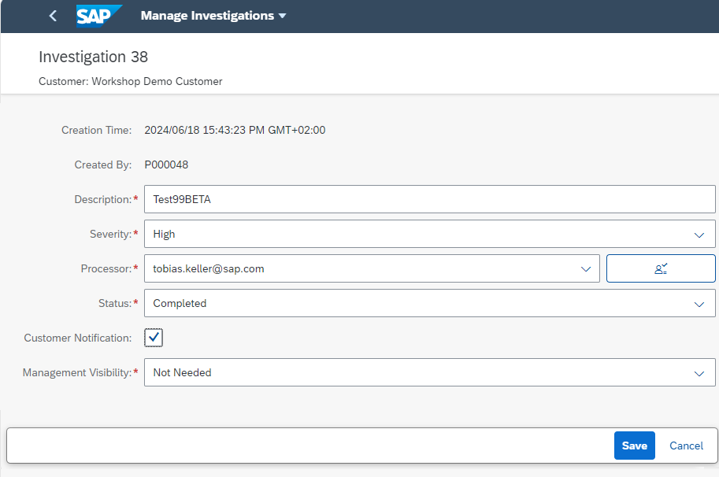

This closes the investigation, and no more changes are possible.

- At the same time, an Investigation Record is created (and a link sent via mail to the addresses maintained in chapter 7.1). This may take a couple of minutes.

This concludes the SAP Enterprise Threat Detection, public cloud part of the threat countering process. The further proceedings would now be in the hands of the investigations report processor(s) (see next chapter), who may involve their security team to take action on the system users and physical persons behind them.

---

## 8. Consumer/Processor role: Work with Investigation reports

> **This exercise is Demo only!**

You are now switching to your 3rd role as consumer/processor of the final product, the investigation report.

Logon to the consumer view of SAP Enterprise Threat Detection, cloud edition.

Use the ID indicated to you (01-35; afterwards referred to as "##")

**User:** teched##@etdsap.com  
**Password:** will be provided in the session

You see the starting page for the consumer/processor role. It contains some view-only tiles, provided for corresponding transparency, if the analysis is provided by a service. The processor role does hence not see the analysis tiles.

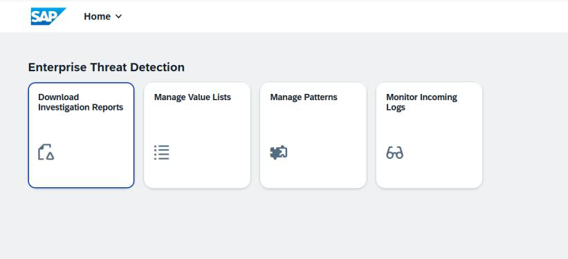

Click on Tile 'Download Investigation Reports'

In the opening list UI, find your investigation (i.e. with your description), provided by you in your role as a security analyst.

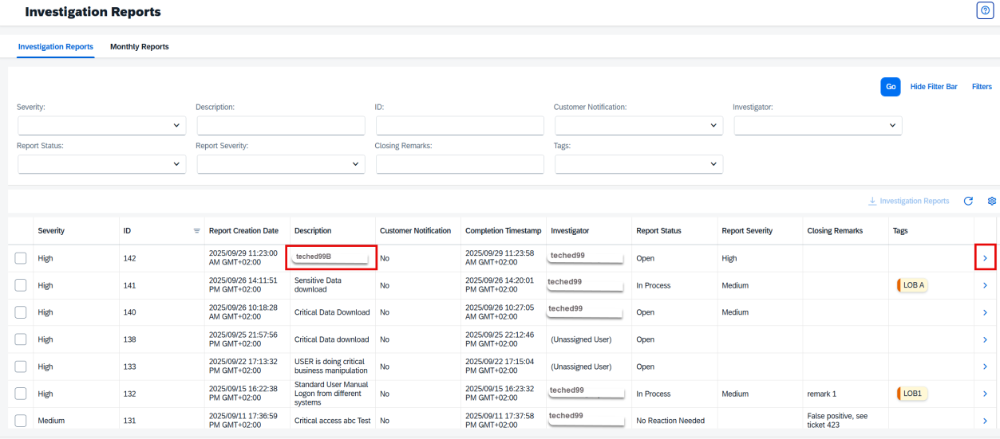

By clicking on the small arrow, the Details-UI opens. By using the 'Download Investigation Report', a PDF document is downloaded. It contains all evidences (recommendations, comments, Alerts, triggering events)

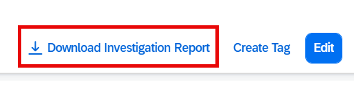

An example report looks like:

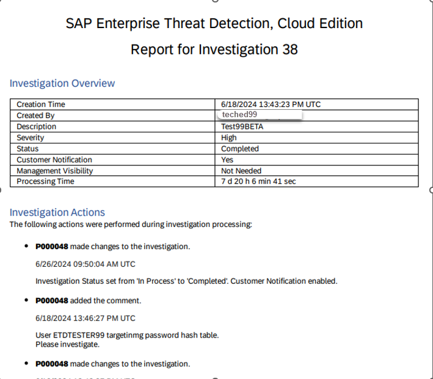

The Download activity can be seen in the 'Download History' Section

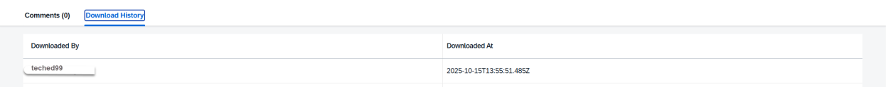

By clicking on the 'Edit' Button, the entry fields can be changed. The processor of the Investigation Report can here enter his own status about mitigation of the incidents, which are analyzed by the security specialist.

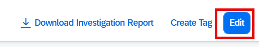

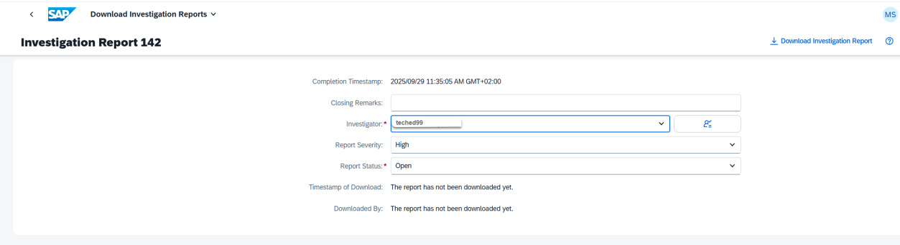

You can play around with filling the different fields, and save it.

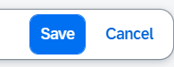

> **Information:** After selecting the Report to the status 'Closed', it cannot be re-edited again, as to compliance reasons.

Additionally, you can add tags with search keywords, on which you can easily search in the Report list.

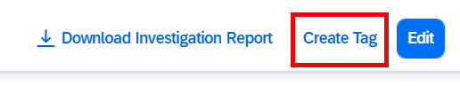

Enter a tag value, and enter the 'Create' Button.

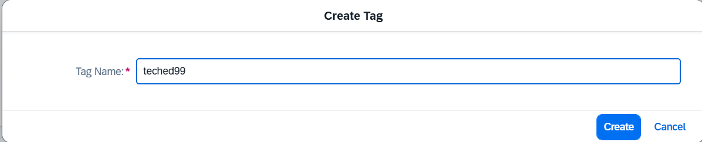

Afterwards, you find the tag value in the 'Details'-UI.

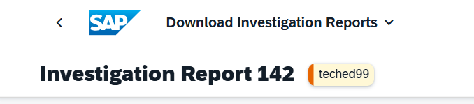

And, going back to the list, you find the tag in the list entry, and you can search for it

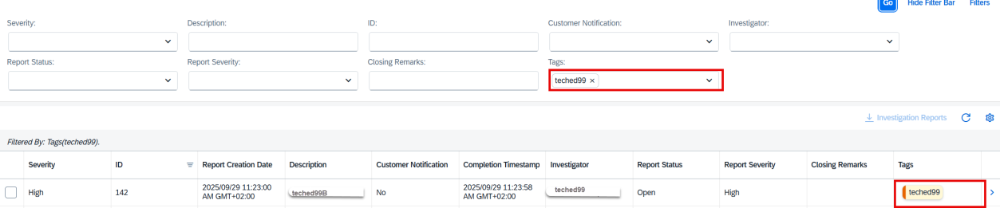

---

## Thank You

>Thank you for your patience and hard work on this demo. We hope you liked this session and exercise!

For any feedback, please address your trainer, or product management:  
**SAP-ETD@sap.com**
